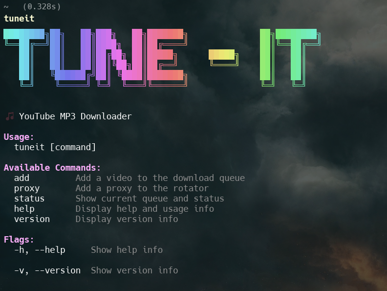

# 🎵 TubeTune – YouTube to MP3 CLI Downloader

> Convert your favorite YouTube videos to MP3s in seconds — from the terminal, powered by Node.js and yt-dlp.

---

## 🚀 What is TubeTune?

TubeTune is a command-line tool that lets you **convert YouTube videos to MP3 files effortlessly**. Built with Node.js, it uses `yt-dlp` under the hood along with proxy rotation and event-driven queuing to ensure stable and efficient downloads.

---

## 🤔 Why was this built?

I just wanted a clean way to batch-download YouTube videos into MP3 format, **without shady websites**, popup ads, or online converters that crash after 1 download.

So I thought:
> "Why not just make my own CLI with full control, proxy support, and even ASCII banners?"

And that’s how **TubeTune** was born.

---

## 📁 Project Structure

```

TubeTune/
├── cli/
│   └── index.js
├── core/
│   ├── Config.js
│   ├── cookies.txt
│   ├── Downloader.js
│   ├── DownloadQueue.js
│   └── ProxyRotator.js
├── downloads/
├── node\_modules/
├── utils/
│   ├── asciiBanner.js
│   └── logger.js
├── .env
├── .gitignore
├── LICENSE
├── package-lock.json
└── package.json

````

---

## 🛠️ Setup Instructions

### 1. Clone the repo

```bash
git clone [https://github.com/yourusername/TubeTune.git]
(https://github.com/yourusername/TubeTune.git)
cd TubeTune
```

### 2\. Install dependencies

```bash
npm install
```

### 3\. Link the command globally (so you can use `tuneit`)

```bash
npm link
```

### 4\. [RECOMMENDED] Export cookies from your browser

YouTube has gotten strict. For many videos, you'll get:

❌ `"Sign in to confirm you're not a bot"`

To fix this, export your cookies from your browser using this [extension](https://www.google.com/search?q=https://chrome.google.com/webstore/detail/get-cookies-txt/gpmfngjjdkfodnhchcnoaninfbdhffx). Save the file as `cookies.txt` in the root of the project.

## 📸 Screenshots (Sample)



 <video width="800" height="400" controls>
  <source src="./Images/TuneIT.mp4" type="video/mp4">
</video> 

-----

## 🧪 How to Use

```bash
# Single video
tuneit "[https://youtube.com/watch?v=](https://youtube.com/watch?v=)..."

# With proxy
tuneit --proxy "http://username:password@ip:port"

# Help menu
tuneit --help

# Version
tunit --version
```

-----

## 🧩 Features

- ✅ YouTube to MP3 conversion using `yt-dlp`
- ✅ Download queue with retries
- ✅ Proxy support (rotates automatically)
- ✅ Clean ASCII CLI with banners
- ✅ Supports `cookies.txt` to bypass bot checks

-----

## 🌐 Why `cookies.txt` is essential?

Some YouTube videos now require login verification or age checks. Without `cookies.txt`, `yt-dlp` will fail on these videos with:

❌ `ERROR: Sign in to confirm you’re not a bot`

To fix:

1. Export cookies from your browser
2. Save them as `cookies.txt` in the project root


## 🤝 Contribute

Contributions are welcome\! Open an issue, suggest a feature, or raise a PR.

## ⚖️ License

```bash
MIT License — free to use, modify, and share.
```

Made with 💻, 🎧 and way too many proxies.